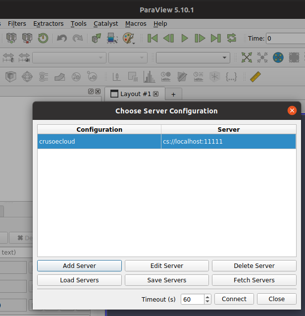

# Paraview remote rendering tests

This assumes you have some familiarity with running Paraview and connecting to a remote server.



After spinning up an instance, the following steps can be executed to setup a running remote pvserver. This means you will know the \<crusoe-cloud-instance-ip\>

```
export CRUSOE_CLOUD_INSTANCE_IP=<crusoe-cloud-instance-ip>
```

Ensure that any existing IP is not stashed in ssh's known_hosts
```
ssh-keygen -f "$HOME/.ssh/known_hosts" -R $CRUSOE_CLOUD_INSTANCE_IP
```

Ensure that your local version of Paraview matches the remote version, otherwise, the remote rendering protocol may fail due to mismatch

It is probably easier to have one console window for each step for easier monitoring

## Run ansible script to download and install Paraview

```
ansible-playbook -u root --inventory $CRUSOE_CLOUD_INSTANCE_IP, crusoe-paraview.yml
```

## Run pvserver remotely
```
ssh root@$CRUSOE_CLOUD_INSTANCE_IP /tmp/ParaView-5.10.1-egl-MPI-Linux-Python3.9-x86_64/bin/pvserver
```

## Tunnel into the instance to open up the pvserver port
```
ssh -N -L 11111:127.0.0.1:11111 root@$CRUSOE_CLOUD_INSTANCE_IP
```
*NOTE*: This means that you can connect to the remote server via a local-host port rather than a remote-host port in the traditional way.

## Monitor the remote CPU usage
```
ssh root@$CRUSOE_CLOUD_INSTANCE_IP -t top
```
